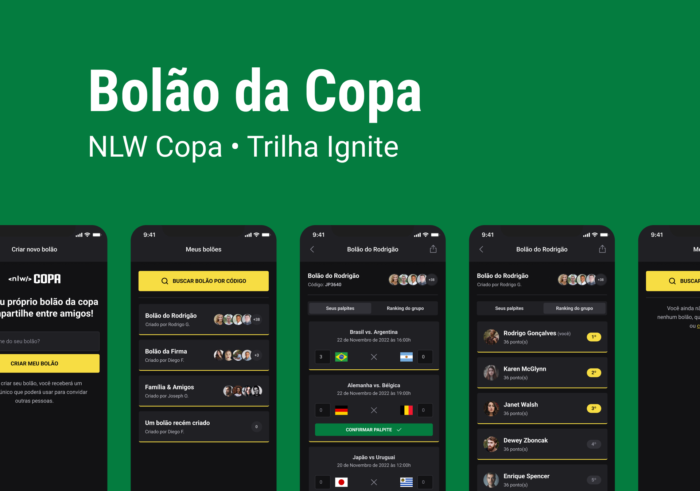

<h1 align="center">
    Bolão da Copa
</h1>

<p align="center">
  <a href="#-tech">Tech</a>&nbsp;&nbsp;&nbsp;|&nbsp;&nbsp;&nbsp;
  <a href="#-project">Project</a>&nbsp;&nbsp;|&nbsp;&nbsp;&nbsp;
  <a href="#-run">Run</a>&nbsp;&nbsp;|&nbsp;&nbsp;&nbsp;
</p>

<p align="center">
  
</p>

## 🔧 Tech

This project has been developed with:

- [Node.js](https://nodejs.org/en/)
- [Next.js](https://nextjs.org/)
- [React](https://reactjs.org)
- [React Native](https://facebook.github.io/react-native/)
- [Expo](https://expo.io/)
- [TypeScript](https://www.typescriptlang.org/)
- [Prisma](https://www.prisma.io/)
- [NativeBase](https://nativebase.io/)

## 💻 Project

A polls application that let user create new polls on web version and search for existing polls in mobile version.

## 🚦 Run

To get full experience, you must run web and mobile environment.

1. Run back-end:

```bash

#nlw-copa/server

npm install && npm run dev

#or

yarn && yarn dev

```

2. Run web version:

```bash

#nlw-copa/web

npm install && npm run dev

#or

yarn && yarn dev

```

3. Run web version:

```bash

#nlw-copa/mobile

npm install && npm run start

#or

yarn && yarn start

```

This project was guided and inspired by [Rocketseat](https://www.rocketseat.com.br/discover)
